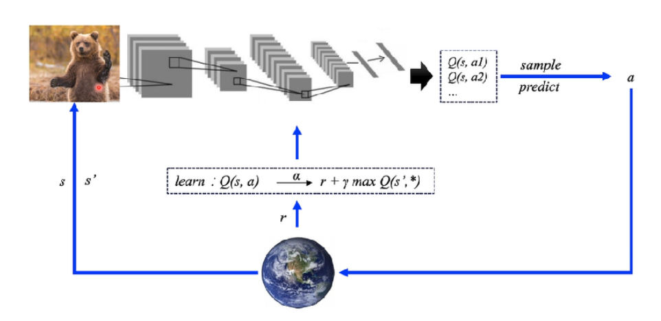
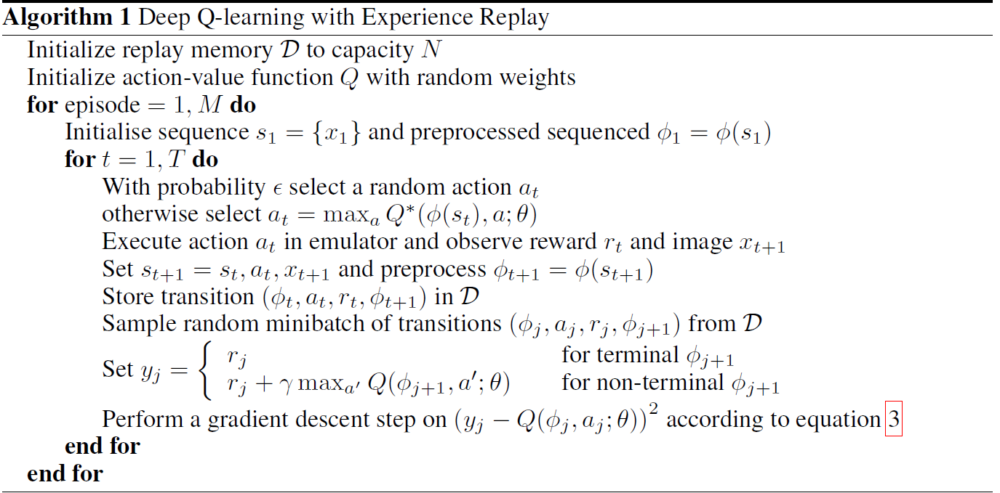
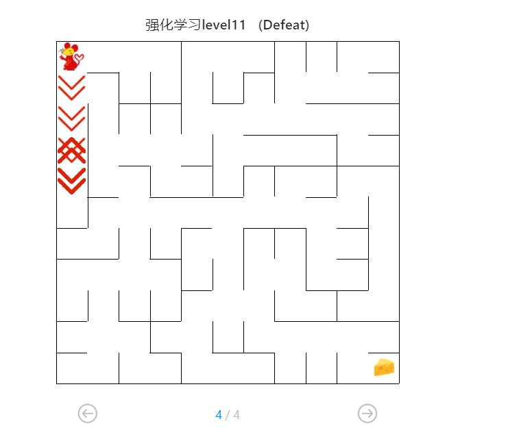
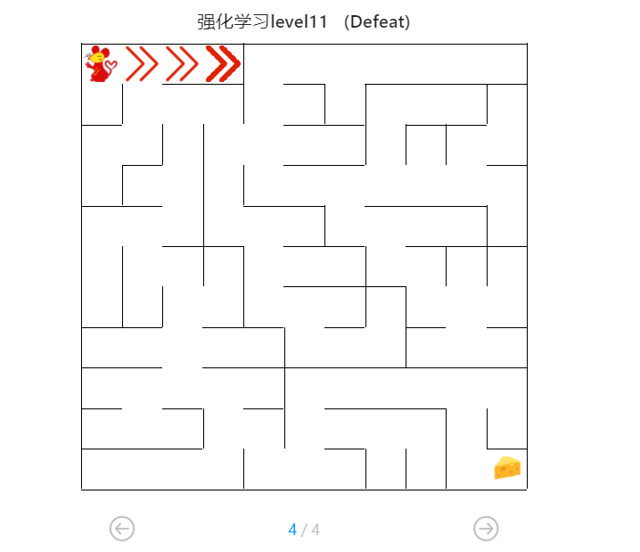
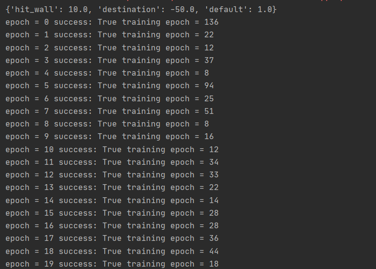
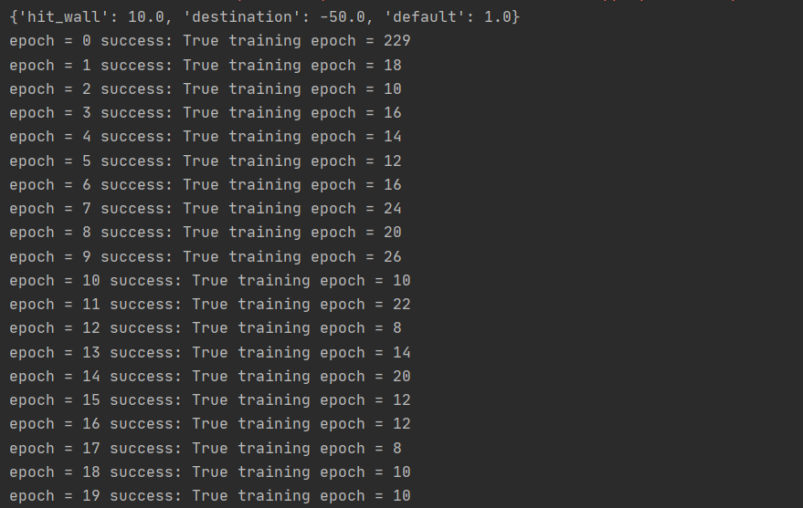
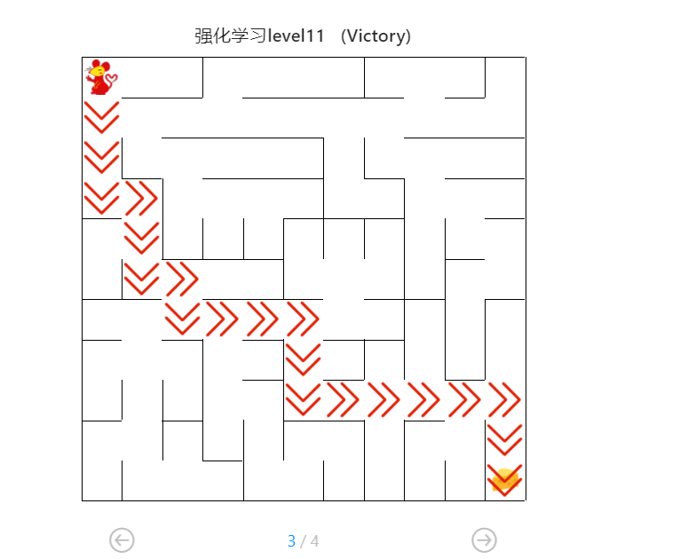

# 机器人自动走迷宫

| 实验名称 | 机器人自动走迷宫 |
| -------- | ---------------- |
| 姓名     | 宗威旭           |
| 学号     | 3180102776       |
| 学院     | 计算机科学与技术 |

## 一、问题重述

题目要求通过基本搜索方法（BFS, DFS, A*）实现迷宫探索。并实现 Q-learning 和 deep-Q-learning 方法，通过 Maze 应用实例进行实验来掌握强化学习的原理及应用。

## 二、设计思想

### 0. 迷宫问题

迷宫问题中，实验中的迷宫满足如下条件：

* 迷宫大小设置为 N, 迷宫形状为 N × N 的方格
* 起始点总是位于迷宫左上角，终点总是位于迷宫右下角
* 事实上，可以把迷宫中的格子看为三种状态：
  * block：边界，无法通行
  * free：机器人能且仅能在此通行
  * destination：出口，最终目标点
* 在每个格子，机器人可以选择四种移动方向：u, l, d, r 分别表示上，左，下，右

可以看到迷宫问题的特点是状态较少。如果用状态表示当前机器人在大小为 N×N 的迷宫中的进行过程，则总共有 N × N 个状态，每个状态仅有四种移动方向。假如用 $s$ 表示当前状态，$a$ 表示机器人的行动方向，用 $Q(s, a)$ 表示状态 $s$ 下机器人采取行动 $a$ 这一动作。按这种方式记录，$|Q(s,a)| = 4 × N × N$ 。

### 1. 基本搜索方法

常见的三种的搜索算法有广度优先搜索、深度优先搜索和最佳优先搜索。这里也不是重点，我选择实现了改动量很小的深度优先搜索。题目中给出的已经实现的广度优先搜索通过迭代实现，通过一个队列结构保存层次结构信息。对于深度优先搜索，仍然使用迭代实现，只需要将队列结构改为栈结构即可保存路线信息。

### 2. Q-learning

迷宫问题中，项目主要尝试基于强化学习实现。在强化学习中，智能体则是通过其与环境交互得到的奖励进行学习，有五个核心组成部分，它们分别是：**环境（Environment）**、**智能体（Agent）**、**状态（State）**、**动作（Action）**和**奖励（Reward）**。在迷宫问题（环境）中，状态和动作已经在上面提到，智能体是机器人。奖励则需要根据机器人的行动从环境中得到反馈。模型最终是促使机器人尽可能以短的路径走到终点，因此，可以根据机器人采取的下一步行动后的状态来给与不同的 reward：

* 空白格子：没有很大问题，但我们希望机器人尽快到达终点，应该给一个较小的负反馈
* 目标点：我们想要的点，应该给一个大的正反馈
* 障碍：我们不希望机器人撞墙，所以应该给一个较大的负反馈
* 附注：如果这个格子，机器人之前已经来过，那么我们其实不希望机器人走重复的路，我们可以给一定的负反馈，尽量避免重复路线

我们将机器人的一次有限步的探索视为一个 epoch，作为一个单独的训练单元。同时，为了避免机器人无止境的探索，应该给一个训练设定一个最大值，或者设定一个 迭代 reward 目标值的 thresh，避免机器人无意义的重复动作。

在一轮探索过程中，我们的最终目的是找到一个正确的策略 $\pi$ 来在迷宫中做出正确的决策，对于机器人在迷宫中所处的每个状态，$\pi$ 都应给出对应的 $a$，使得机器人尽快到达终点。该策略将用户所处的状态作为输入，给 agent 返回正确的方案：
$$
a_{i} = \pi(si)
$$
在策略的初期，我们的决策方案可以随机选取，并根据评估该行动所产生的 reward 作为给我们决策方案的反馈，使得决策方案尽可能避免产生不好的动作。当决策方案有了一定经验之后，评估产生的是一个行动的 vector，来表示不同的动作对应的 `reward`。这里的 reward 并不只是考虑当前动作的单一效果，还需要结合策略经验。

* exploration：开发新的未探索过的状态，初期应该尽可能探索，后期应当逐渐减少次数。
* exploitation：结合已经探索过的状态做出决定。应该占据决策过程的大多数。

因此，我们可以设置一个系数 $epsilon$ ，用于控制两种方式的比例。逐渐衰减 $epsilon$ 的值即可逐渐减少 exploration 的次数。

针对上述过程，我们概括为一个状态转移函数，和一个奖励值函数：
$$
s' = T(s,a) \\ r =R(s,a)
$$
那我们的目标应该是得到一系列最优的动作 $a_i$，使得
$$
A = \sum_{i=1}^{n}{R(s_i,a_i)}
$$
得到一个最大值（视 reward 取值而定）。

因此，我们可以想到，尽可能让 $\pi$ 做出的决策的每一步拿到一个最优的 reward。即
$$
\pi(s)=argmax Q(s, a)
$$
我们可以将每一种状态下采取每一种行动记录为一张表 $Q(s, a)$

| Q-Table | a1        | a2        |
| ------- | --------- | --------- |
| s1      | Q(s1, a1) | Q(s1, a2) |
| s2      | Q(s2, a1) | Q(s2, a2) |
| s3      | Q(s3, a1) | Q(s3, a2) |

对于每一次状态转移 $s'=T(s,a)$，我们可以利用得到的 $R(s,a)$ 和 Q表的历史进行更新 (update)。
$$
Q(s_{t},a) = R_{t+1} + \gamma \times\max_a Q(a,s_{t+1})
$$
其中，$\gamma$ 是折损系数 (discount)，用于控制两种机制的更新比例。我们也可以增加一个松弛因子 $\alpha$ ，使得 Q表的更新更为平稳
$$
Q(s_{t},a) = (1-\alpha) \times Q(s_{t},a) + \alpha \times(R_{t+1} + \gamma \times\max_a Q(a,s_{t+1}))
$$

### 3. Deep-Q-learning

上面的过程中，我们主要是用Q表来担任决策过程。但Q表实际通用性并不很高，例如在DQN的那篇经典论文中，Atari游戏的输入为 84×84×4 的 image，那么状态的种类就有 $(84×84×4)^{256}$种，显然这是不可能用Q表记录的。

这里，我们的Q表本质上是一个最佳效用函数（best utility function），目的是让我们的决策尽可能的去贴近正确的函数。因此，DQN相比Q-learning最直观的区别，是通过一个卷积神经网络来拟合，从而避免使用大量的状态记录信息。



DQN 算法中使用的神经网络为一个简单的两层全连接神经网络。输入为机器人的所在位置（状态），输出为一个表示四个动作的评估值的向量。

参考论文给出的 DQN 算法流程如下：



首先，进行一系列的初始化。初始化一个内存区域 $D$，用来保存中间过程的历史访问信息。单元为：
$$
(state, action, reward, next\_state)
$$
每次训练过程中，设置一个训练的最大步数。机器人的每一步，根据 $\epsilon$ 的值随机化选择 exploration 和 exploitation，其中，后者需要用卷积网络（最佳效能函数）选择行动。将这次状态转移存入内存区域 $D$ 中。而后，从 $D$ 中随机取出大小为 `batch` 的历史信息。对于卷积网络进行一次梯度下降。这里在实际中需要记录一个游戏是否结束的信息，以便选择支中对应 $y_i$ 的值。

初始化衰减系数 $\epsilon$ 和折扣因子 $\gamma$ ，设置迭代次数 `epoch`。使用的神经网络的损失函数，将目标Q值作为损失函数的标签即可。

## 三、代码内容

### 1. 深度优先搜索

深度优先搜索和广度优先搜索实现类似。但是迭代过程中，深度优先搜索通过栈（先进后出）来维持节点的不同层次信息。

```python
def my_search(maze):
	"""
    任选深度优先搜索算法、最佳优先搜索（A*)算法实现其中一种
    :param maze: 迷宫对象
    :return :到达目标点的路径 如：["u","u","r",...]
    """

    path = []
    
    # -----------------请实现你的算法代码--------------------------------------
    start = maze.sense_robot()
    root = SearchTree(loc=start)
    h, w, _ = maze.maze_data.shape
    is_visit_m = np.zeros((h, w), dtype=np.int)  # 标记迷宫的各个位置是否被访问过
    stack = [root]
    while True:
        current_node = stack.pop()
        is_visit_m[current_node.loc] = 1  # 标记当前节点位置已访问
        if current_node.loc == maze.destination:  # 到达目标点
            path = back_propagation(current_node)
            break
        
        if current_node.is_leaf():
            expand(maze, is_visit_m, current_node)
        # 入栈
        for child in current_node.children:
            stack.append(child)
   return path
```

### 2.Q-learning

该部分有较多功能函数。这里只主要说明单步训练过程。首先，获取机器人所处的位置（状态），如果该状态在Q表不存在，则初始化其在Q表的位置。而后，根据上面原理部分的介绍选择移动方向，并得到机器人移动后的状态。最终，根据上述信息更新Q表的值。

```python
def train_update(self):
	"""
	以训练状态选择动作，并更新相关参数
	:return :action, reward 如："u", -1
	"""

	self.state = self.sense_state()  # 获取机器人当初所处迷宫位置
	self.create_Qtable_line(self.state)  # 对当前状态，检索Q表，如果不存在则添加进入Q表

	action = random.choice(self.valid_action) if random.random() < self.epsilon else max(
		self.q_table[self.state], key=self.q_table[self.state].get)  # 选择动作

	reward = self.maze.move_robot(action)  # 以给定的动作（移动方向）移动机器人

	next_state = self.sense_state()  # 获取机器人执行动作后所处的位置
	self.create_Qtable_line(next_state)  # 对当前 next_state ，检索Q表，如果不存在则添加进入Q表
	self.update_Qtable(reward, action, next_state)  # 更新 Q 表 中 Q 值
	self.update_parameter()  # 更新其它参数
    
    return action, reward
```

对于测试过程，则根据我们训练出的Q表，每一次选择Q表中最优动作即可。

```python
def test_update(self):
    """
    以测试状态选择动作，并更新相关参数
    :return :action, reward 如："u", -1
    """
    self.state = self.sense_state()  # 获取机器人当初所处迷宫位置
    self.create_Qtable_line(self.state)  # 对当前状态，检索Q表，如果不存在则添加进入Q表
    action = max(self.q_table[self.state], key=self.q_table[self.state].get)  # 选择动作
    reward = self.maze.move_robot(action)  # 以给定的动作（移动方向）移动机器人
    return action, reward
```

此处选择的 reward 机制仍然为 `Maze` 类中使用的默认值。也就是说，目标是让单步决策结果最大化：

```python
self.reward = {
    "hit_wall": -10.,
    "destination": 50.,
    "default": -0.1,
}
```

### 3.Deep-Q-learning

首先是卷积神经网络部分，使用一个简单的两个全连接层构成。

```python
class QNetwork(nn.Module, ABC):
    """Actor (Policy) Model."""

    def __init__(self, state_size: int, action_size: int, seed: int):
        """Initialize parameters and build model.
        Params
        ======
            state_size (int): Dimension of each state
            action_size (int): Dimension of each action
            seed (int): Random seed
        """

        super(QNetwork, self).__init__()
        self.seed = torch.manual_seed(seed)
        self.input_hidden = nn.Sequential(
            nn.Linear(state_size, 512),
            nn.ReLU(False),
            nn.Linear(512, 512),
            nn.ReLU(False),
        )

        self.final_fc = nn.Linear(512, action_size)

    def forward(self, state):
        """Build a network that maps state -> action values."""
        x = self.input_hidden(state)
        return self.final_fc(x)
```

在使用前构造神经网络，并设置损失函数，使用优化器为 `Adam`

```python
def _build_network(self):
    seed = 0
    random.seed(seed)
    """build target model"""
    self.target_model = QNetwork(state_size=2, action_size=4, seed=seed).to(self.device)
    """build eval model"""
    self.eval_model = QNetwork(state_size=2, action_size=4, seed=seed).to(self.device)
    """build the optimizer"""
    self.optimizer = optim.Adam(self.eval_model.parameters(), lr=self.learning_rate)
```

构造储存历史状态信息的内存空间，题目中提供了ReplayDataSet类和对应接口。

```python
class ReplayDataSet(object):
    def add(self, state, action_index, reward, next_state, is_terminal):
        """添加一条记录"""
        pass
    def random_sample(self, batch_size):
        """获取batch_size记录"""
        pass
    def build_full_view(self, maze: Maze):
        """
        金手指，获取迷宫全图视野的数据集
        :param maze: 由Maze类实例化的对象
        """
```

训练总体流程如下。仍然是由最佳效能函数选择 action，得到转移状态，并且将一条完整的信息保存到内存区域。注意需要更新 epsilon 的值，相比上面的 Q-learning 更为缓慢。

```python
def train_update(self):
    state = self.sense_state()
    action = self._choose_action(state)
    reward = self.maze.move_robot(action)
    next_state = self.sense_state()
    is_terminal = 1 if next_state == self.maze.destination or next_state == state else 0

    self.memory.add(state, self.valid_action.index(action), reward, next_state, is_terminal)

    """--间隔一段时间更新target network权重--"""
    if self.step % self.EveryUpdate == 0:
        self._learn(batch=32)

    """---update the step and epsilon---"""
    self.step += 1
    self.epsilon = max(0.01, self.epsilon * 0.9)

    return action, reward
```

选择 action 时，与 Q-learning 的不同点在于 exploitation 的过程是通过神经网络得到

```python
def _choose_action(self, state):
    state = np.array(state)
    state = torch.from_numpy(state).float().to(self.device)
    if random.random() < self.epsilon:
        action = random.choice(self.valid_action)
    else:
        self.eval_model.eval()
        with torch.no_grad():
            q_next = self.eval_model(state).cpu().data.numpy()  # use target model choose action
        self.eval_model.train()

        action = self.valid_action[np.argmin(q_next).item()]
    return action
```

在上面的训练过程较为复杂。需要取出若干条(batch size)训练信息。这里用 target 表示 $y_i$，用 eval 作为目标函数。得到两边的值后进行一次梯度下降。最终需要记得将 eval_model 的参数同步到 target_model。

```python
def _learn(self, batch: int = 16):
    if len(self.memory) < batch:
        print("the memory data is not enough")
        return
    state, action_index, reward, next_state, is_terminal = self.memory.random_sample(batch)

    """ convert the data to tensor type"""
    state = torch.from_numpy(state).float().to(self.device)
    action_index = torch.from_numpy(action_index).long().to(self.device)
    reward = torch.from_numpy(reward).float().to(self.device)
    next_state = torch.from_numpy(next_state).float().to(self.device)
    is_terminal = torch.from_numpy(is_terminal).int().to(self.device)

    self.eval_model.train()
    self.target_model.eval()

    """Get max predicted Q values (for next states) from target model"""
    Q_targets_next = self.target_model(next_state).detach().min(1)[0].unsqueeze(1)

    """Compute Q targets for current states"""
    Q_targets = reward + self.gamma * Q_targets_next * (torch.ones_like(is_terminal) - is_terminal)

    """Get expected Q values from local model"""
    self.optimizer.zero_grad()
    Q_expected = self.eval_model(state).gather(dim=1, index=action_index)

    """Compute loss"""
    loss = F.mse_loss(Q_expected, Q_targets)
    loss_item = loss.item()

    """ Minimize the loss"""
    loss.backward()
    self.optimizer.step()

    """copy the weights of eval_model to the target_model"""
    self.target_replace_op()
    return loss_item
```

## 四、实验结果

仍然是记录通过实验的一系列思路历程：

首先，尝试一下普通的 Q-learning 方法，发现还是比较容易就可以通过初级（3×3）和中级（5×5）的迷宫，训练速度也比较快。高级迷宫的走法一直并不理想，查看一下具体训练结果：



感觉是 exploration 并不是非常充分，因为相对这个图还是比较大。又先尝试 DQN 算法的结果。仍然是高级迷宫较难通过，结果如下：



先总结一下，在 DQN 中，我们要调整的主要几个超参和效果如下：

| parameter     | affect                                             |
| ------------- | -------------------------------------------------- |
| gamma         | 控制下一个状态决策的最大分数对当前更新值的影响程度 |
| learning rate | 值越大代表状态决策表更新的幅度越大                 |
| epsilon       | 控制exploration和exploitation各自的程度            |

另外，测试步数有限。我们需要尽量避免在有限的步数内浪费很多时间去徘徊。所以，可以记录一下历史访问情况，在 exploration 这部分加快探索速度。在本地观察了一下训练情况的gif，发现最主要的问题，很多时候机器人在某个墙角原地不动很多步骤。在本来就有限的步数内还要花费很多时间去学习这个错误，这样效率还是很低的。根据部分尝试和经验值，主要参数取值基本如下。

| parameter     | value                          |
| ------------- | ------------------------------ |
| gamma         | 0.85-0.95                      |
| learning rate | 0.005                          |
| epsilon       | 0.01-0.9，动态变化。视情况而定 |

可以先设置 `training_epoch=20`， `training_per_epoch=300` ，观察一下 DQN 算法的效果。我在本地修改了一下 Runner 类中提供的 run_training 接口，以便每次训练结果更直观的展现出来。以 Maze 的大小为 5×5 为例：



我们可以看到默认给出的DQN算法实现表现并不算太好，每次的 training epoch 保持的不够稳定，最后也没有趋向收敛。这个时候可以适当调整 $\gamma$ 的取值，调大一些，把 eplison 的放缩变快一些。可以得到相对较好的结果。



经过上面的不断尝试，不断改变训练次数，每次训练最大步数和迷宫大小。对于 DQN 算法，设 `epoch=40`，`training_epoch=600` ，仍然不能找到迷宫终点。另一方面，我也尝试了对于 Q-Learning，发现当 `epoch=35`，`training_epoch=300`能够找到 maze size 为 11 的终点。

| method     | maze size | epoch | training epoch | success rate |
| ---------- | --------- | ----- | -------------- | ------------ |
| DQN        | 5         | 20    | 300            | 8/10         |
| DQN        | 9         | 20    | 300            | 2/5          |
| DQN        | 11        | 20    | 300            | 0/5          |
| DQN        | 11        | 40    | 600            | 0/5          |
| Q-learning | 5         | 20    | 300            | 10/10        |
| Q-learning | 9         | 20    | 300            | 10/10        |
| Q-learning | 11        | 20    | 300            | 0/10         |
| Q-learning | 11        | 35    | 300            | 5/10         |
| Q-learning | 11        | 40    | 600            | 10/10        |

从上面的尝试过程得到一点直观的认知：由于这里的状态数量并不多，Q-learning 在该问题上不仅有较高的运行效率，也有更快的训练速度。因此，我想在解决题目中 Maze 问题尽可能使用 Q-learning。还有一点原因是，Q-learning 在中级迷宫的训练总 epoch 数量约在 350-550 之间，而 DQN 的总 epoch 数量很难低于 800，大多数在 1000 以上。对于题目中的中级迷宫也很难在较短的训练次数成功。

下面的描述都是对于 Q-learning 来说。对于较小规模的迷宫，表现已经基本令人满意。但是对于较大的迷宫，我们的训练过程很难找到终点。从上面诸多尝试可以得到最直接的感受：找到迷宫的步数利用的不够充分。体现在这几个方面：

* 很多时候，机器人在某个地方会撞墙。这是正常的，他需要在那个位置（state）学习到在那里撞墙这个 action 是愚蠢的。但是他学的太慢了，可能他要在某个地方撞个四五次，他才会意识到这是愚蠢的。
* 机器人在徘徊：这一点其实与上面是有关的。一方面，如果 eplison 衰减的较快，在较短的训练步数内，我们很难充分探索。比如可能机器人卡在了某个墙角（错误的路），但是 eplison 很小，机器人做 exploration 的欲望很低，但是另一方面，他在那个墙角又撞了很多次墙，学习到自己撞墙是愚蠢的。但是他也无法知道更聪明的路线，对他来说损失最小的做法就是在错误的地方原地不停打转。

因此，为了人为提高训练的效率，我们必须对于机器人在大迷宫的训练加以监督和干涉。这样做其实并不符合 Q-learning 和 DQN 的通用性，相当于把算法强行移植到解决迷宫问题上。但没办法，题目给我们的可用的步数实在太少了，我们也没有足够的时间祈祷一次奇迹。

针对上述两种问题，有下面这几种解决方案，并且这几种解决方案必须共同使用，才能解决上面的问题：

* 对于第一个问题，我们可以适当调大学习率（但不能太大，还是不要超过 0.1）。最主要的是，我们需要增加机器人撞墙的惩罚，让机器人撞一次墙就足够学习到这是错误的。但仅仅做这一点改动并没有用，这会导致出现上面所说的第二个徘徊问题。
* 解决徘徊问题，我们需要保证机器人的探索是充足的。这一点就必须给一个足够大的 epsilon 值。但是不能太大，应该让机器人学习到一些错误的经验。这一点，我们可以把眼光放长远一些。我们不必在每次训练中都去缩减 epsilon 的值。仔细想想，我们可以把整个训练过程分为前期和后期。前期，我们需要鼓励机器人充分探索整个迷宫。当他找到终点，应该给予一个足够大的奖励。这一过程应该有一个较大的 epsilon 值。后期，我们需要学习以往的探索经验，即调小 epsilon 的值。以便机器人做出正确的判断。
* 提高探索效率：我们可以记录机器人的访问位置（针对整个训练过程而言，而不是单次游戏）。在探索中，我们把纯随机变为伪随机过程，优先探索那些有效位置：即不是撞墙，而且探索历史次数最小。我们在这里还可以做一个更高效的处理：当机器人钻到某个墙角时，这种情况肯定要避免，我们可以给一个极大的探索记录值，尽量减少机器人在探索过程中回到这个地方的可能性。

对此，我增加了两个全局变量来保存训练次数信息，和格子访问信息：

```python
is_visit_m = None
glo_times = 0

def init_visit(h, w):
    global is_visit_m
    if is_visit_m:
        return
    else:
        is_visit_m = np.zeros((h, w), dtype=np.int)
```

训练过程中，将被访问的状态增加访问次数：

```python
is_visit_m[self.state] += 1
```

伪随机过程如下：优先访问没有撞墙，访问次数小的格子，充分利用探索发挥的作用。当机器人到了三面是墙的墙角，记录一个很大的访问次数值，尽量避免其在探索时回到这里。

```python
def pesudo_random_choice(self):
    global is_visit_m
    valid_move = []
    visit_lst = []
    for move in self.valid_action:
        if not self.maze.is_hit_wall(self.sense_state(), move):
            valid_move.append(move)
            x, y = self.sense_state()[0] + move_map[move][0], self.sense_state()[1] + move_map[move][1]
            visit_lst.append(is_visit_m[(x, y)])

    if len(valid_move) == 1:
        is_visit_m[self.sense_state()] += 10
    target_action = valid_move[visit_lst.index(min(visit_lst))]
    return target_action
```

对于 epsilon 值的设定，我最终没有让其在单个 epoch 里不断减小，而是让其根据 epoch 之间进行减小。前期让其偏探索，设置较大的 epsilon 。后期让其加强学习，缩小 epsilon 的取值。

另外，给 hit_wall 设置一个较大的惩罚值，给目标点设置一个很大的奖励值。加快其学习速度。

```python
if self.maze_size > 9:
    self.maze.set_reward(reward={
        "hit_wall": -100.,
        "destination": 20000.,
        "default": -0.2,
    })
    if glo_times > 15:
        self.epsilon = 0.2
    elif glo_times > 12:
        self.epsilon = 0.5
    else:
        self.epsilon = 0.9
```

最终，在这种有些荒谬的取值下，终于过了所有测试点：



## 五、总结

其实关于机器人走迷宫，学习数据结构的说话写过最佳优先搜索。迷宫问题的状态实际并不算很多，用Q表解决一些简单的迷宫问题都还处于可以接受的范围内。在一些比较小范围的迷宫里，Q表的运行效率是高于 DQN 算法实现的。而对于更广泛的应用场景，需要保存的状态是大量的，用卷积网络来拟合最佳效能函数更加具有实际意义。

看着自己DQN算法训练过程的gif图其实也挺揪心的，从算法的行为模式来看，机器人很大一段时间都处于随机乱撞，来回徘徊这样一个过程。本质上 exploration 和 exploitation 的调整其实很难在较大的迷宫有一个理想的状态。最近在和同学做一个基于DQN实现游戏玩家训练的场景，这个项目相对应用场景就非常复杂，需要对于视频流进行处理。而且图像帧存在一定的延迟，当某个动作发生时，不一定立刻就能拿到对应的 reward，这也需要更复杂的神经网络来实现。这个作业对于进行这个项目也是一个不错的入门练习。不过想想这应该也是个比较具体的应用场景，这让我感觉这种通用性方法来解决某个具体问题，其实是一个比较好的指导思想，但仍然缺少不了自己人为监督干涉的过程。
