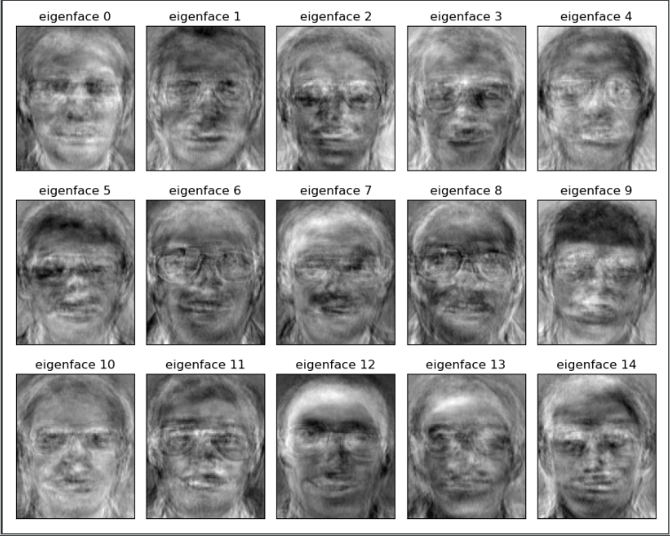
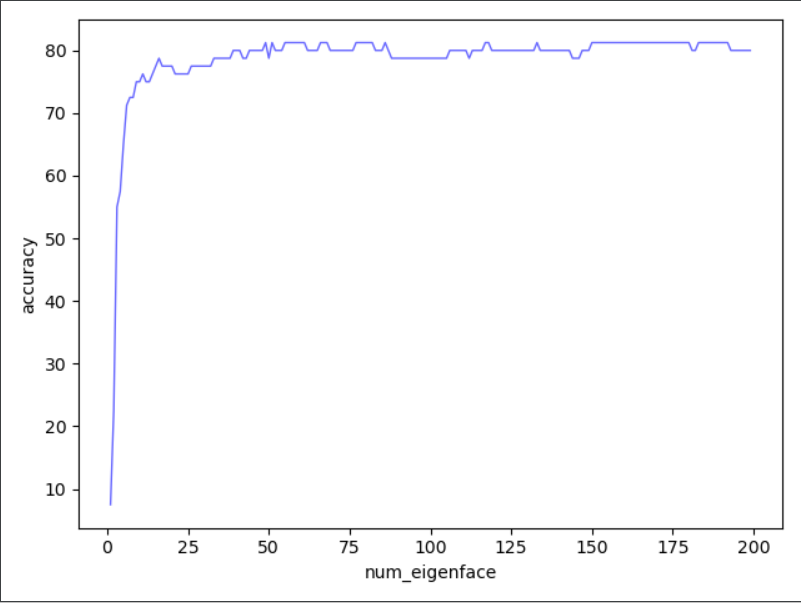
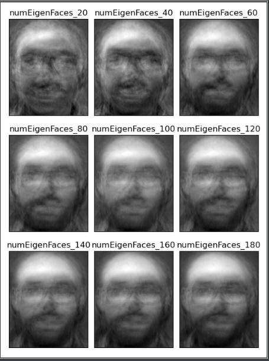
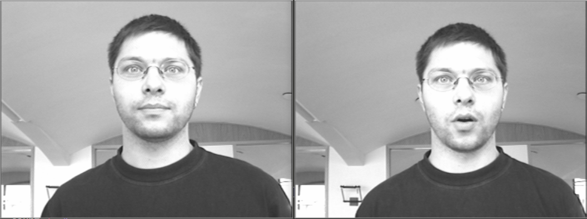
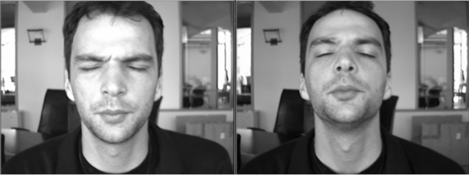
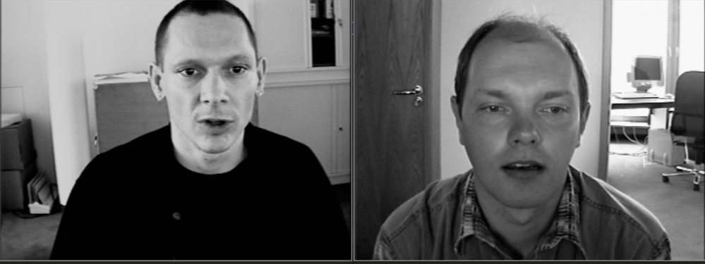
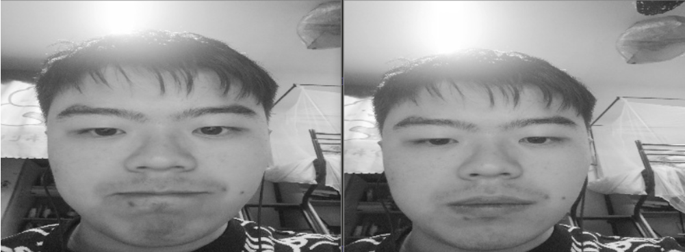

# 特征人脸识别

| 实验名称 | 特征人脸识别     |
| -------- | ---------------- |
| 姓名     | 宗威旭           |
| 学号     | 3180102776       |
| 学院     | 计算机科学与技术 |

## 一、问题重述

题目中要求设计三个功能函数：特征人脸算法，人脸识别模型以及人脸重建模型。题目要求基于ORL人脸库，建立自己的人脸库。在此基础上，复现基于主成分分析的特征人脸(eigenface)算法。实现识别和重构算法后，改变采用特征脸的个数，记录识别人脸的正确率，并观察人脸重构的效果。

## 二、设计思想

 项目主要分为几个主要过程：图像预处理、划分数据集、人脸特征提取、人脸识别过程和人脸重建过程。首先进行的是图像预处理。使用训练数据/测试数据时，要保证所有数据的dimension、颜色空间一致。为了得到标准的实验数据，图像处理的过程如下：读入图像的灰度图，进行仿射变换（旋转，平移，缩放），目的是使人脸在图片中占据主要部分，并调整所有人脸的比例和位置基本一致，旋转则是以人脸的双眼作为水平线进行校准。最终对图像做归一化处理。

得到预处理后的归一化图像，需要将图像分为训练集和测试集。针对实验中给出的ORL数据集，我们选用每名志愿者的前五张图片作为训练集，后两张图片作为测试集。针对自己的数据集，则需要额外标定数据集的标签。

为了得到用于特征向量计算的训练集，我们需要转换图像的维度。假设训练集的数据大小为 $N$，图像大小为 $(H, W)$，则用于计算的数据集应该为 $N × HW$ 的矩阵，表示为$(x_1, x_2, x_3, ..., x_n)$。下一步，对于每个数据 $x_i$ 做中心化处理，令 $x_i=x_i-\mu$，其中 $\mu=\frac{1}{N}\sum_{j=1}^{n}{x_j}$。将中心化后得到的矩阵为 $A$，则协方差矩阵可以表示为
$$
\sum=\frac{1}{N-1}A^TA
$$
进而需要求出协方差矩阵的特征值和特征向量。由于往往有 $N << H*W$，所以可以通过下述方法减少运算量：
$$
(AA^T)u_i=\lambda_iu_i \\ A^T(AA^T)u_i=A^T\lambda_iu_i \\ (A^TA)A^Tu_i=\lambda_i(A^Tu_i)
$$
可知，我们要求的特征向量 $v_i = A^Tu_i$， 因此，只需要求出矩阵 $AA^T$ 的特征值 $u_i$ 即可。其中 $AA^T$ 的维度为 $(N, N)$。

针对得到的特征向量，我们将其按照特征值从大到小的顺序排序，并根据参数指定，选取 $K$ 个特征向量。最终得到 $(K, HW)$ 的特征脸矩阵，用于识别和重建过程的空间转换。这一过程的主要原理是通过主成分分析（PCA）进行降维。协方差矩阵表示不同维度间的相关程度，为了尽可能地在降维的同时保留更多的有效信息，我们选用协方差矩阵特征值更大的特征向量。

在识别过程中，我们需要将待测图象和数据库中人脸图像转换到同一空间进行比较。这一空间则通过我们刚才得到的特征脸矩阵进行空间转换。将图像拉伸成 $(1, HW)$ 的向量，转换成特征脸空间的坐标 ，空间维度为 $K$ 。将测试集中数据转换到特征脸空间后，通过计算与人脸库中数据点的距离来判断相似程度，选择距离最小的点（人脸库对应的图像）作为匹配结果。距离计算的方法有多种，这里采用的是最简单的欧氏距离，选取欧氏距离最小（空间距离最近）的点最为匹配结果。算法还可以用于人脸的恢复重建。人脸恢复重建可以理解为上面空间转换的逆过程。得到的是一个长度为 $HW$ 的人脸向量。

$K / N$ 的值表示为能量比，表示我们选取的特征数量。能量比过大容易导致特征点的不明显，而能量比过小则不足以表达人脸库的特征。因此，我们还需要测试不同 $K$ 值下的特征效果，通过识别正确率和重建图像程度进行衡量。

## 三、代码内容

### 1. 人脸特征提取

主要进行特征值和特征向量的计算。依次求出均值人脸，中心化人脸，特征向量，归一化向量等。这里需要对特征值的大小进行排序，优先选择特征值较大的对应的特征向量。

```python
def eigen_train(trainset, k = 20):

    # 均值人脸
    avg_img = np.mean(trainset, 0)
    # 中心化人脸
    norm_img = trainset - avg_img
    # 协方差矩阵
    covar = np.dot(norm_img, norm_img.T) / (norm_img.shape[0] - 1)
    e, u = np.linalg.eig(covar)
    # 左奇异向量
    sorted_indices = np.argsort(-e)
    lst = []
    for idx in sorted_indices[:k]:
        lst.append(u[idx])
    u_left = np.array(lst)
    # 右奇异向量
    feature = np.dot(u_left, norm_img)
    # 范数归一化
    feature_normalized = preprocessing.normalize(feature, norm='l2')

    # 返回：平均人脸、特征人脸、中心化人脸
    return avg_img, feature, norm_img
```

### 2. 人脸识别

这里的人脸识别实际上具体是指空间转换。实际的识别（距离计算）在主函数中。这里需要将图像向量和特征脸矩阵做矩阵乘法从而进行空间转换，最终得到该向量在特征空间的坐标表示。通过`numComponents` 控制特征向量的使用个数。

```python
def rep_face(image, avg_img, eigenface_vects, numComponents=0):
    numEigenFaces = numComponents if numComponents < eigenface_vects.shape[0] else eigenface_vects.shape[0]
    eigenfaces_vects_use = eigenface_vects[:numEigenFaces, :]
    mean_img = image - avg_img
    representation = np.dot(mean_img, eigenfaces_vects_use.T)

    # 返回：输入数据的特征向量表示, 特征脸使用数量
    return representation, numEigenFaces
```

### 3. 人脸重建

这里可以理解为识别过程空间转换的逆过程，重新转换到图像表示的空间来重建原人脸。

```python
def recFace(representations, avg_img, eigenVectors, numComponents, sz=(112, 92)):
    
    numEigenFaces = numComponents if numComponents < eigenVectors.shape[0] else eigenVectors.shape[0]
    eigenface_vects = eigenVectors[:numEigenFaces, :] + avg_img
    face = np.dot(representations, eigenface_vects)

    # 返回: 重建人脸, str 使用的特征人脸数量
    return face, 'numEigenFaces_{}'.format(numComponents)

```

## 四、实验结果

首先展示使用原ORL的实验数据。首先是当选取的特征脸数量 $K=150$ 时，选取的特征脸如下：



改变选取的 $K$ 的数量，$K$ 值与识别过程准确率关系图如下，正确率最高值为 81.25%。可以看到，当特征向量在前面特征较少时随着特征增加迅速升高。在特征量足够大时，正确率趋于稳定，而并非一定随着特征量的增多而继续提高。



改变选取的 $K$ 的数量，图像恢复效果如下，图像选择为测试集第28名志愿者的第一张人脸。随着特征向量的增加，重建效果基本提高。



使用的其他人脸数据库为`BioFaceDatabase`，该数据库提供了眼睛位置，便于图像校准。而图像尺寸较大，因此进行了缩放和人脸选择。部分实验效果如下。左面为测试集，右面为人脸库（未缩放原图，便于确认实验结果）

下图：训练集作为测试图。



下图：测试集未出现在人脸库



下图：人脸库不存在该人脸



下图：我个人的人脸。前置摄像头比例有些失调。



## 五、总结

首先想提到的是实际实现的思路历程。这里遇到了一个小细节的问题，numpy.cov()默认的底数 `bias` 为 $(K-1)$，而PCA里一般使用的bias有些版本为K。这里为了实现更加灵活，最终我选择自己实现求协方差矩阵的过程。较为曲折的过程还是建立自己的人脸库。在之前使用了mo平台提供的缩放方法，然后实验效果并不如意。经过实际观察，才发现默认的放缩会让我使用图像的人脸成为很糟的数据。有些图背景占了很大部分，人脸占比太小，有些图像中则脸并没有完全出现在图像上。经过挑选，让人脸尽量位于图像的正中央，占比较大，实验数据相对正常。

调整实验结果的过程中比较关键的点，在于如何选取特征向量。这样说不是很准确，应该说是选取多少特征向量。我们选取的方式自然是基于PCA算法，尽可能地在降低维度的同时保存更多有效信息。但维度的选取（特征向量的数量）是一大难点，我们很有可能选择了不够具有代表性的特征向量。这是一个相当复杂的问题，也是早期eigenface未能有效解决的，只能根据实际情况，做反复的调参（能量比例）。这一点上，通过基于深度学习，让反馈机制更好的结合，可以进一步提高准确率。总的来说，找到科学的降维方法还是比较有挑战性的一件事情。总的来说，这次实验加深了我对视觉处理的认识，即将图像转变到另一子空间，再进行比较。也让我熟悉了实现降维方法的过程。
